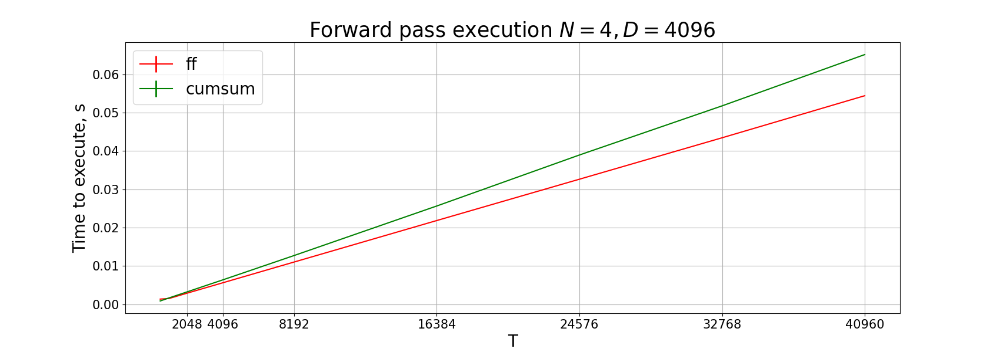
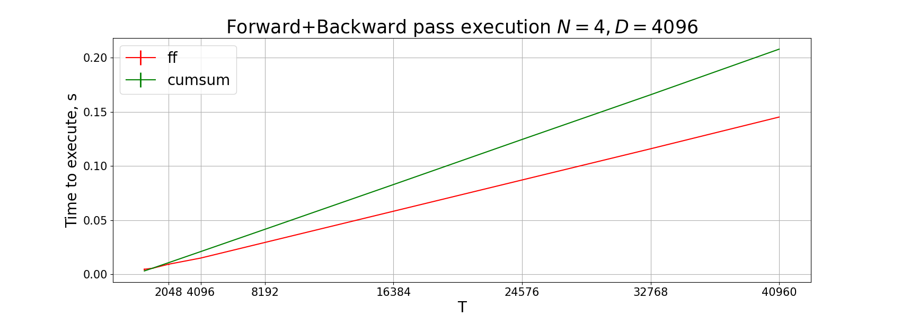

### 1. Introduction

This repo is inspired by a series of recent posts by François Fleuret on [X](https://twitter.com/francoisfleuret/status/1735907836238954589). The goal is to implement the PScan algorithm in a simple yet efficient way

### 2. Problem

Let's consider a tensor $X \in \mathbb{R}^{N \times T \times D}$, and a matrix $A \in \mathbb{R}^{N \times T}$. Let's denote:
 $$X[:, t, :] \text{ as } X_t$$  $$A[:, t] \text{ as } A_t$$  $$Y[:, t, :] \text{ as } Y_t$$

And let $$Y_0 = X_0$$
And let $Y_t$ can be calculated as follows:

$$Y_t = A_{t - 1} * Y_{t-1} + X_t $$

Where $A_{t - 1} * Y_{t-1}$ stands for a component-wise product of $A_t$ and $Y_t$. The goal is to calculate $Y \in \mathbb{R}^{N \times T \times D}$.

### 3. Solution

#### 3.0 Notations

Let's denote a binary upper triangular matrix of size $T$ as $U_T$ and respectively binary lower triangular matrix as $L_T = (U_T)^T$:

$$ U_T = \begin{bmatrix}
1 & 1 & ... & 1 & 1\\
0 & 1 & ... & 1 & 1 \\
\vdots & \vdots & ... & \vdots & \vdots \\
0 & 0 & ... & 0 & 1\\
0 & 0 & ... & 0 & 1 \\
\end{bmatrix} \in \mathbb{R}^{T \times T}$$

Note that $L_T \cdot X$ for any vector $X$ is essentially equivalent to  $\text{cumsum} = (\sum\limits_{k=0}^{0} X_k, ..., \sum\limits_{k=0}^{T-2} X_k, \sum\limits_{k=0}^{T-1} X_k)^T$. Moreover, a product $U_T \cdot X$ can be expressed as "reversed cumsum", i.e. $\text{rev cumsum} = (\sum\limits_{k=T-1}^{T-1} X_k, ..., \sum\limits_{k=T-1}^{T-2} X_k, \sum\limits_{k=T-1}^{0} X_k)^T$

#### 3.1 Reformulation

Knowing that $Y_t = A_{t - 1} * Y_{t - 1} + X_t$ we can substitute $Y_{t - 1}$ and get 

$$Y_t = X_t + A_{t - 1} * X_{t-1} + A_{t - 1} * A_{t - 2} * Y_{t-1}$$

Following the recursion, for every $t > 0$ and using $\left[ ... \right]$ to group different components of the equation:

$$Y_t = \left[ X_t \right] + \left[ A_{t - 1} * X_{t - 1} \right] + \left[ A_{t - 1} * A_{t - 2} * X_{t - 2} \right] + ... +  \left[ A_{t - 1} * A_{t - 2} * ... * A_0 * X_0 \right] $$

Now lets denote $A_i * A_{i-1} * ... * A_{j}$ as $Z_{i, j}$, then we can rewrite the above equation $\forall n \in \left[ 0, 1, ..., N - 1\right]$:

$$ \ Y[n, :, :] = X[n, :, :] + \begin{bmatrix}
0 & 0 & ... & 0 & 0 & 0 \\
Z_{0,0} & 0 & ... & 0 & 0 & 0\\
Z_{1,0} & Z_{1, 1} & ... & 0 & 0 & 0 \\
\vdots & \vdots & ... & \vdots  & \vdots  & \vdots \\
Z_{T-3,0} & Z_{T-3, 1} & ... & Z_{T-3, T-3} &  0 & 0\\
Z_{T-2,0} & Z_{T-2, 1} & ... & Z_{T-2, T-3} &  Z_{T-2, T-2} & 0\\
\end{bmatrix} \cdot X[n, :, :]$$

Or using `torch` notation:

```
Y = X + torch.bmm(M, X)
```

Unfortunately, the product `torch.bmm(M, X)` requires $O(T^2)$ operations to compute, so we have to calculate it in a more efficient way. Let's first consider the matrix $Z$.

#### 3.2 $Z$ matrix

First, note the first row of $M$ is composed of only $0$ so lets consider matrix $Z$ such that:

```
M = torch.cat([torch.zeros(N, 1, D), Z], dim=1)
```

The matrix $Z$ will be defined as follows:

$$ Z = \begin{bmatrix}
Z_{0,0} & 0 & ... & 0 & 0 & 0\\
Z_{1,0} & Z_{1, 1} & ... & 0 & 0 & 0 \\
\vdots & \vdots & ... & \vdots  & \vdots  & \vdots \\
Z_{T-3,0} & Z_{T-3, 1} & ... & Z_{T-3, T-3} &  0 & 0\\
Z_{T-2,0} & Z_{T-2, 1} & ... & Z_{T-2, T-3} &  Z_{T-2, T-2} & 0\\
\end{bmatrix} $$

$Z$ can be expressed more compactly using matrix notation, using a binary lower triangular matrix $L_T$ introduced earlier and a matrix $\overline{Z}$ as follows:

$$ \overline{Z} = \begin{bmatrix}
Z_{0,0} & Z_{0, 1} & ...& Z_{0, T-1}\\
Z_{1,0} & Z_{1, 1} & ... & Z_{1, T-1} \\
\vdots & \vdots & ... & \vdots \\
Z_{T-1,0} & Z_{1, 1} & ... & Z_{T-1, T-1} \\
\end{bmatrix} $$

Then
```
Z = Z_ * L_T
```

#### 3.3 Components of $\overline{Z}$

By def $Z_{i,j} = A_i * A_{i-1} * ... A_{j}$. Then $Z_{i, j} = exp(\sum\limits_{k=j}^i \ln(A_k))$. Note that since calculations can be performed over complex variables the fact that $A$ might have negative values is not a problem, we just need to compute `torch.log` in the complex space, then $\log(-|x|)$ can be computed using $|x| \cdot e^{i \cdot \phi} = |x| \cdot \cos(\phi) + |x| \cdot i \sin(\phi)= -|x|$, so $\log(-|x|) = \log\(|x|) + i \pi$.

Now let's express $\overline{Z}$ as a matrix-vector product, $\forall n$:

$$\overline{Z}[n, t, :t + 1] = U_t \cdot \begin{bmatrix}
\ln(A[n, 0]) \\
\ln(A[n, 1]) \\
\vdots \\
\ln(A[n, t-1]) \\
\end{bmatrix} = \text{rev cumsum}(\ln(A[n, :t-1]))
$$

$$
\overline{Z}[n, t, t + 1:] = 0
$$

or in PyTorch:
```
D[n, :, :] = torch.cat([U_t, torch.zeros(T - t, T)], dim=0)
Z_[n, t, :] = D[n, :, :] @ torch.log(A)[n, :]
```

It turns out this product can be computed efficiently using either FFT or `CumSum`. Turns out we can extend matrix $D[n, :, :]$ to make it [Circulant](https://en.wikipedia.org/wiki/Circulant_matrix) and leveraging FFT we can multiply circulant matrix by vector in just $O(T \log (T))$ operation, there is an [excellent paper](https://arxiv.org/pdf/2103.02605.pdf) about Circulant matices. Another approach is to leverage distributed `CumSum`. However, even though $Z$ can be computed efficiently, it still requires $O(N^2)$ to store the tensor in memory and $O(N^2)$ to calculate the product of this tensor with $X$. So in the next section, we will get rid of `torch.bmm(M, X)` entirely. 

#### 3.4 Efficient Implementation

#### 3.4.1 Intuition

First let's have a look at $Z[n, T - 1, :]$:

$$
Z[n, T - 1, :] = \left(\sum\limits_{k=0}^{T-1} \ln(A[n, k]), \sum\limits_{k=1}^{T-1} \ln(A[n, k]), ..., \sum\limits_{k=T-2}^{T-1} \ln(A[n, k])\right)^T
$$

or, in other words:

$$
Z[n, T - 1, :] =  U_{T} \cdot \begin{bmatrix}
\ln(A[n, 0]) \\
\ln(A[n, 1]) \\
\vdots \\
\ln(A[n, T-1]) \\
\end{bmatrix}
$$

As we said earlier, the product of any vector on the matrix $U_T$ can be computed efficiently using either FFT or CumSum. If we denote `A_log.cumsum(dim=-1)` as `CS`, then `Z[n, T - 1, :] = CS[:, -1].unsqueeze(-1) + A_log - CS`. Now let's note the following fact, for any $t$:

```
Z[n, t - 2, :] = (Z[n, t - 1, :] - ln(A[n, t - 1])) * torch.cat([torch.ones(t), torch.zeros(T-t)])
```

So this leads to the conclusion that knowing $Z[n, T - 1, :]$ we can easily calculate $Z[n, t, :]$ for any $t$ by gradually subtracting $\ln(A[n, k])$ and using a proper mask `torch.cat([torch.ones(t), torch.zeros(T-t)])`. Let's now rewrite this in a tensor form. Lets denote $Z[n, T - 1, :]$ as $V$

$$
Y = X + \text{exp}(Z) \cdot X = X + (L_T * \text{exp}(\overline{Z})) \cdot X
$$

where 

$$
\overline{Z} = \begin{bmatrix}
V_0, V_1, ..., V_T \\
V_0, V_1, ..., V_T \\
\vdots \\
V_0, V_1, ..., V_T \\
\end{bmatrix} - \begin{bmatrix}
0 & 1 & 1 & ...& 1 & 1 \\
0 & 0 & 1 & ... & 1 & 1 \\
\vdots & \vdots &\vdots & \vdots & \vdots & \vdots \\
0 & 0 & 0 & ... & 1 & 1 \\
0 & 0 & 0 & ... & 0 & 1 \\
0 & 0 & 0 & ... & 0 & 0 \\
\end{bmatrix} \cdot \begin{bmatrix}
\ln(A[n, 0]) & \ln(A[n, 0]) & ... & \ln(A[n, 0])\\
\ln(A[n, 1]) & \ln(A[n, 1]) & ... & \ln(A[n, 1]) \\
\vdots \\
\ln(A[n, T-1]) & \ln(A[n, T-1]) & ... & \ln(A[n, T-1])\\
\end{bmatrix} =
$$

or 

$$
\begin{bmatrix}
V_0, V_1, ..., V_T \\
V_0, V_1, ..., V_T \\
\vdots \\
V_0, V_1, ..., V_T \\
\end{bmatrix} - (U_T - I) \cdot \begin{bmatrix}
\ln(A[n, 0]) & \ln(A[n, 0]) & ... & \ln(A[n, 0])\\
\ln(A[n, 1]) & \ln(A[n, 1]) & ... & \ln(A[n, 1]) \\
\vdots \\
\ln(A[n, T-1]) & \ln(A[n, T-1]) & ... & \ln(A[n, T-1])\\
\end{bmatrix} = \begin{bmatrix}
V^T \\
V^T \\
\vdots \\
V^T \\
\end{bmatrix} - \begin{bmatrix}
W &
W &
... &
W &
\end{bmatrix}
$$

Moreover, we know that we can compute the product of $U_T$ with any vector efficiently, so both $V$ and $W$ can be computed in a fast way.

#### 3.4.2 $V$ and $W$

We know that both $V$ and $W$ can be calculated efficiently, the only thing remaining is to compute $Y$ efficiently. Knowing that both $V$ and $W$ have shape $N \times T$ we can rewrite the equating the following way:

```
Y = X + (L_T * torch.exp(V.unsqueeze(1) - W.unsqueeze(2))) @ X
```

Let's have a closer look for any fixed $n$:

$$
L_T * \begin{bmatrix}
e^{V_0} \cdot e^{-W_0} & e^{V_1} \cdot e^{-W_0} & ... & e^{V_{T-1}} \cdot e^{-W_0} \\
e^{V_0} \cdot e^{-W_1} & e^{V_1} \cdot e^{-W_1} & ... & e^{V_{T-1}} \cdot e^{-W_1} \\
\vdots \\
e^{V_0} \cdot e^{-W_{T-1}} & e^{V_1} \cdot e^{-W_{T-1}} & ... & e^{V_{T-1}} \cdot e^{-W_{T-1}} \\
\end{bmatrix} = \begin{bmatrix}
e^{V_0} \cdot e^{-W_0} & 0 & ... & 0 \\
e^{V_0} \cdot e^{-W_1} & e^{V_1} \cdot e^{-W_1} & ... & 0 \\
\vdots \\
e^{V_0} \cdot e^{-W_{T-1}} & e^{V_1} \cdot e^{-W_{T-1}} & ... & e^{V_{T-1}} \cdot e^{-W_{T-1}} \\
\end{bmatrix}
$$

or 

$$
\exp(V)^T * L_T * \exp(-W)
$$

The final step is to use the following trick. For any vector $a$ and matrix $B$: $a^T * B = \text{diag}(a) \cdot B$, and $B * a = B \cdot \text{diag}(a)$, so we get a very elegant formula for $Y$:

$$
Y = X + \text{diag}(e^{V}) \cdot L_T \cdot \text{diag}(e^{W}) \cdot X = X + (e^{V})^T * (L_T \cdot (e^{W} * X))
$$

Or using the `CumSum` operation:

$$
Y = X + (e^{V})^T * (cumsum(e^{W} * X, dim=1))
$$

$L_T$, as well as $U_T$, can be multiplied by vector efficiently, so in this formulation, by varying the algorithm to compute `CumSum` we can achieve different performances. In the next few sections, we explain different `CumSum` algorithms, their tradeoffs, and their complexities. 

### 3.5 `CumSum` algorithms

#### pytorch `CumSum` (`src/cumsum.py`)

See [pytorch official docs](https://pytorch.org/docs/stable/generated/torch.cumsum.html) for more details

#### FFT-based (`src/fft_efficient.py`)

Turns out we can extend matrix $U_T$ and $L_T$ to make them [Circulant](https://en.wikipedia.org/wiki/Circulant_matrix), and leveraging FFT we can multiply circulant matrix by vector in just $O(T \log (T))$ operation, there is an [excellent paper](https://arxiv.org/pdf/2103.02605.pdf) about Circulant matices. See more details in file `FFT.md`


### 4. Code

To run the code `pytorch` and `tqdm` are required. The recommended way is to use docker, the image can be built running:
```
docker build -it scan . 
```


### 5. Benchmarking

Here we compare `cusum` implementation with the one proposed [by François Fleuret](https://fleuret.org/cgi-bin/gitweb/gitweb.cgi). Benchmarking conducted with NVIDIA V100, see [Dockerfile](https://github.com/maximzubkov/fft-scan/blob/main/Dockerfile) for the environment details, and [benchmark.py](https://github.com/maximzubkov/fft-scan/blob/main/benchmark.py). 





